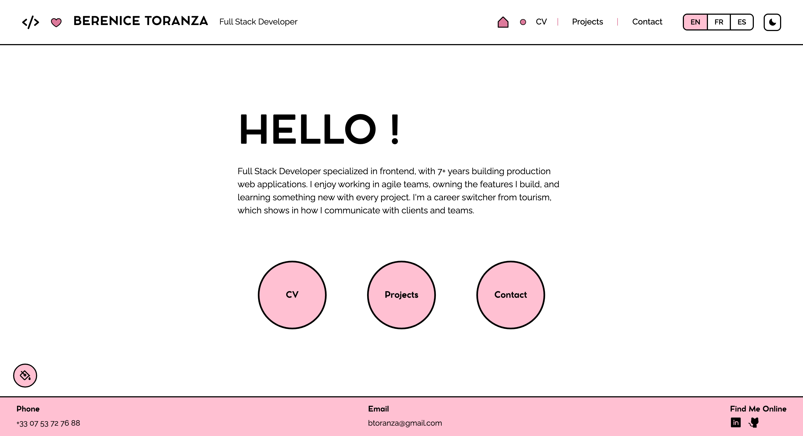
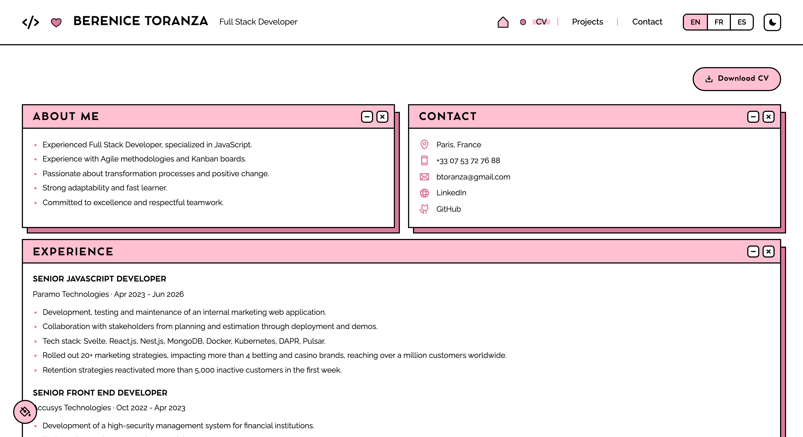
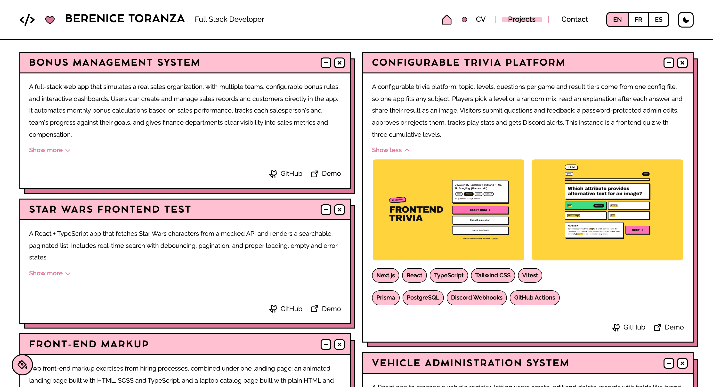
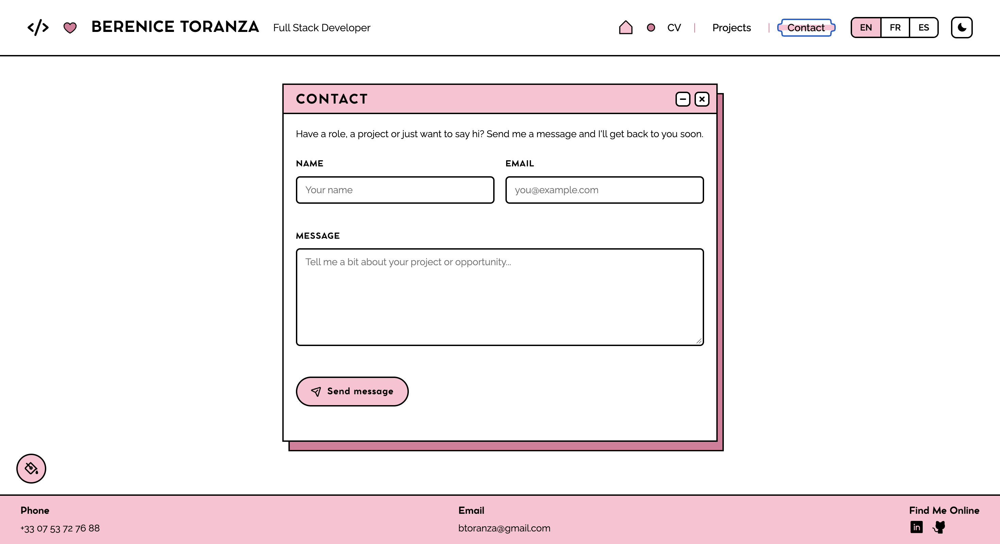

# CV Virtual — Berenice Toranza

Personal portfolio / CV, built as a self-directed project to practice full-stack development: a React front-end with a "post-it and desktop windows" visual style, and a lightweight backend that sends contact form messages by email.

🔗 **Live site:** [berenice-toranza.dev](https://berenice-toranza.dev)

## Preview

| Home | CV |
| --- | --- |
|  |  |

| Projects | Contact |
| --- | --- |
|  |  |

## Features

- **3 languages** (English, French, Spanish), with content split into shared + translated data.
- **Light/dark mode**, respects the system preference when nothing is saved yet.
- **Live color palette picker**, with 6 preset combinations, persisted in `localStorage`.
- **Fully responsive**: hamburger menu on mobile, compact nav on tablet, 1-to-3 column grids depending on width.
- **Real contact form**: validates, sends the email via [Resend](https://resend.com), and shows a toast + confetti on success.
- **CV download as PDF**, serving the right file for the active language.
- **Expandable project cards**, showing screenshots, tech stack, and links to the repo/demo.

## Tech stack

**Frontend** (`client/`)
- React 19 + TypeScript + Vite
- SCSS Modules
- React Router 7
- [Phosphor Icons](https://phosphoricons.com)

**Backend** (`server/`)
- Node.js + Express
- [Resend](https://resend.com) for sending emails

## Project structure

```
cv-virtual/
├── client/          # Frontend (Vite + React)
│   └── src/
│       ├── assets/       # Images for the projects shown in the portfolio
│       ├── components/   # Reusable components (WindowCard, ProjectCard, etc.)
│       ├── content/       # Content in 3 languages (shared + en/fr/es)
│       ├── context/       # Theme, language and color palette
│       ├── layout/         # Header, footer and overall site layout
│       └── pages/          # Home, Resume, Projects, Contact
└── server/          # Backend (Express)
    └── src/
        └── index.ts       # /contact endpoint that sends the email
```

## Running it locally

### Frontend

```bash
cd client
npm install
cp .env.example .env
npm run dev
```

### Backend

```bash
cd server
npm install
cp .env.example .env
```

Fill in `server/.env` with:
- `GMAIL_USER`: the email address that receives contact form messages.
- `RESEND_API_KEY`: your API key from [resend.com](https://resend.com) (the free plan is enough).

```bash
npm run dev
```

The frontend runs on `http://localhost:5173` and the backend on `http://localhost:3001`.

## Deploy

- **Frontend**: [Vercel](https://vercel.com), Root Directory `client`.
- **Backend**: [Render](https://render.com), Root Directory `server`, Build Command `npm install && npm run build`, Start Command `npm start`.

Environment variables needed on each platform:
- Vercel: `VITE_API_URL` (the backend's URL on Render).
- Render: `GMAIL_USER` and `RESEND_API_KEY`.
